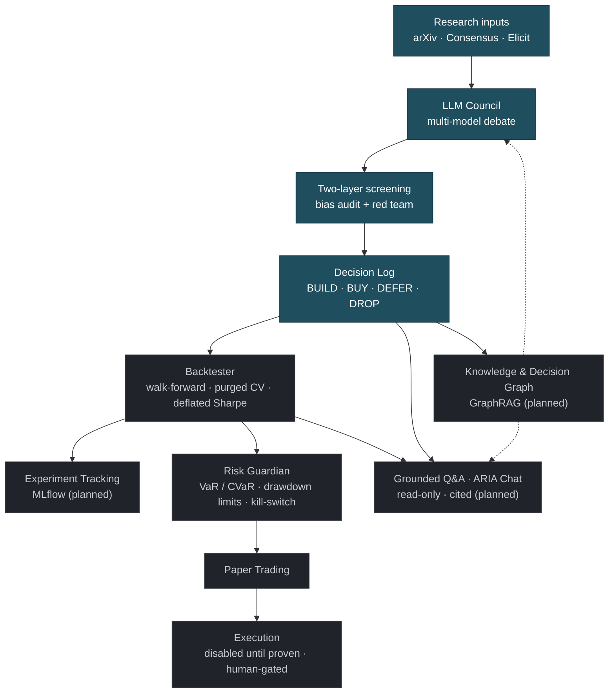

# ARIA — Adaptive Responsive Intelligence Architecture

**A survivability-first quantitative research & decision system — applied, first, to algorithmic trading (Indian + US markets).**

At its core ARIA is an AI research-and-decision engine: every significant design choice is debated by
a council of AI models with deliberately conflicting mandates, screened a second time for bias, and
logged. Algorithmic trading is its first application; the same machinery serves portfolio research,
backtesting, risk analysis, and hypothesis validation.

> *Debate before you build. Prove before you risk. Preserve the Core, always.*

## Current status
**Phase 0 complete → entering Phase 1 (validation on existing platforms).** By design, no *custom*
trading infrastructure is built until the strategy logic is shown to have an edge on free platforms
first. What exists today is the research/decision engine and the validation harness — not a trading bot.

- ✅ **LLM Council** — multi-model debate engine (working code)
- ✅ **Two-layer screening** — bias-audit + red-team re-screen of every verdict
- ✅ **Decision log** — every verdict recorded and dated
- ✅ **Validation & metrics harness** — walk-forward + purged CV splits, and **deflated Sharpe** (the overfit test) — `src/aria/`, unit-tested
- ⬜ **Backtester engine** — run strategies through the harness on real data *(planned, Phase 2)*
- ⬜ **Risk Guardian** — VaR/CVaR, drawdown limits, kill-switch *(planned, Phase 2)*
- ⬜ **Paper trading** — India + US *(planned, Phase 2–3)*
- ⬜ **Dashboard** *(planned, Phase 2–3)*
- ⬜ **Grounded Q&A layer ("ARIA Chat")** — ask ARIA about its own signals, metrics, and decisions in English, answered only from real data via read-only tool-calls with citations — never a price prediction, never a trade *(planned, Phase 3)*
- ⬜ **Live trading** — optional, human-gated, only after paper gates pass *(Phase 4+)*

## Architecture



*Solid teal = already built; grey = planned, each gated behind proof on paper.*

## What it is
ARIA rejects "predict the market" in favour of **manage uncertainty and survive**. Its trading
architecture is a **Dual Barbell**: a conservative Core (~70% cap) kept strictly separate from a small
Aggressive Alpha sleeve (~30% cap, fractional-Kelly-sized), which may fail without ever threatening the
Core.

Every major decision is pressure-tested *before code* by the **[LLM Council](llm-council/)** — agents
with conflicting mandates debating across genuinely different models, then re-screened for bias, with a
calibrated Chair issuing a verdict. Verdicts are logged so no decision is re-argued from scratch.

## How ARIA differs from the typical "AI trading bot"
The common genre — *"I gave an LLM some money and let it trade"* — puts a language model in the
trader's seat, live, often leveraged, and (as its creators usually admit) running on luck. ARIA is
the deliberate opposite:

| Typical "AI trading bot" | ARIA |
|---|---|
| The **LLM makes the trades** | LLMs only **debate the design**; no agent may ever place a live trade (a hard invariant) |
| Real, often **leveraged** money, fast | **Paper-first, no leverage** — zero capital until an edge is proven |
| Ship it and watch (luck-driven) | **Prove it or drop it** — walk-forward + deflated Sharpe to catch overfit and luck |
| Profit / content as the goal | **Learning + survivability** as the goal; preserve capital first |
| Ad hoc, no memory | Every decision **debated, bias-screened, and logged** |

The question ARIA asks isn't *"can a language model trade?"* — it's *"does this **strategy** have a
real, honestly-validated edge before any capital is at risk?"* LLMs reason about the architecture;
deterministic, tested strategies do the trading.

## Talking to ARIA — a grounded Q&A layer *(planned, Phase 3)*
Once ARIA is generating signals and logged results, a plain-English layer will let you ask about them —
*"why did S1 go long today?"*, *"how has this strategy done out-of-sample?"* — held to the same standard
as everything else. It answers **only from real data** via read-only tool-calls, **cites every number**,
**abstains** when it doesn't know, and **refuses to predict prices or place trades**. A two-window UI puts
the chat beside a live **provenance panel**, so every answer is traceable to its source — you *see* what
it's based on, you don't just trust it. Even the way you talk to ARIA is held to the same
prove-don't-claim, no-hallucination standard as the strategies themselves.

## Research standards & targets
Goals are **methodological, not claimed results** — nothing is deployed:
- **Capital preservation first** — every strategy prioritises survivability and controlled risk over
  maximising return.
- **Anti-overfit rigour** — walk-forward validation, purged/embargoed cross-validation, and a
  **deflated Sharpe ratio** (penalised for the number of strategies tried) before a strategy is "validated."
- **Risk measured properly** — VaR / CVaR (expected shortfall), explicit max-drawdown limits, and stress
  replay through historical crises.
- **Statistical honesty** — out-of-sample significance; stationarity / cointegration tests for any
  mean-reversion strategy.
- **Proof before money** — code must reproduce a platform's paper-trading results; **6+ months** of
  consistent paper trading before any (optional) live capital, behind a hard kill-switch.

## Council verdicts so far
The council is deliberately hard to convince — most ideas are deferred until there's evidence, not
adopted on a story. Highlights (full log in [docs/decisions.md](docs/decisions.md)):
- **Dual Barbell structure → DEFER** — prove Core/Alpha isolation in a paper-traded prototype first.
- **Barbell ratio & sizing → DEFER (capped pilot)** — don't lock a number; the Alpha sleeve is a hard
  *cap* with fractional-Kelly sizing within it.
- **Crisis stress-test library → DEFER** — the two-layer screening *reversed its own earlier BUILD* once
  it caught that free, realistic crisis-era data may not exist; audit the data first.
- **Sentiment/news, stat-arb, options-pricing, order-book simulator → DEFER**, each with a concrete next
  step; **ML-trained-on-crises → DROP**.

The reversal is the point: a second screening layer exists to catch the first layer's blind spots.

## Repository structure
```
ARIA/
├── src/aria/             ✅ validation harness + honest metrics
│   ├── validation.py     leakage-free splits: walk-forward, purged K-fold w/ embargo
│   └── metrics.py        Sharpe/Sortino/drawdown + Probabilistic & Deflated Sharpe (overfit test)
├── tests/                ✅ unit tests  (run: pytest -q)
├── llm-council/          ✅ the multi-model debate engine
│   ├── council.py        the orchestrator (seats, two-layer screening, self-healing model IDs)
│   └── topics/           a topic template (real strategy topics kept private)
├── docs/                 methodology · philosophy · roadmap · decisions · agentic-safety
└── (planned) research/ + strategies   Phase 2+, not yet built
```

## Documentation
A public wiki lives in [`docs/`](docs/):
- [Methodology](docs/methodology.md) — the LLM Council & two-layer screening (the interesting part).
- [Philosophy](docs/philosophy.md) — goals, the Dual Barbell, the survive-don't-predict stance.
- [Roadmap](docs/roadmap.md) — the gated phases and their exit gates.
- [Decision log](docs/decisions.md) — every council verdict, dated.
- [Safe agentic development](docs/agentic-safety.md) — how an AI coding agent builds this without ever being able to touch real money.
- [Concepts & methods](docs/concepts.md) — the quant/ML/systems methods ARIA uses and plans to (built vs planned, honestly marked).

## Roadmap (gated phases)
| Phase | Focus | Capital at risk |
|---|---|---|
| 0 *(current)* | Research & architecture council | Zero |
| 1 | Validate strategy edge on existing platforms (India) + Alpaca paper (US) | Zero (paper) |
| 2 | Build the foundation — backtester (walk-forward, purged CV, deflated Sharpe), Risk Guardian | Zero (paper) |
| 3 | Differentiators — regime detection; grounded Q&A layer ("ARIA Chat") over ARIA's own data | Zero (paper) |
| 4 | Tiny live capital, treated as tuition | Small, optional |
| 5 | Aggressive Alpha sleeve | Capped, optional |

Each phase is gated: capital is never deployed before the thing that protects it is proven on paper.

## Development
Repository-wide engineering constraints and AI-development guidelines are documented in
[`AGENTS.md`](AGENTS.md) — they apply to any coding agent (Claude Code, Codex, Gemini CLI, Cursor,
Aider, Continue…) and to human contributors.

**Non-negotiable invariants** (canonical list in `AGENTS.md`):
- Never introduce look-ahead bias.
- Never expose secrets.
- Never enable live trading by default.
- Never suppress failing tests.
- Never report backtest metrics without specifying the validation methodology.
- Every new strategy requires accompanying tests and documentation.

## Compliance stance
ARIA trades only its builder's own capital, within all applicable regulations in both target markets:
- **India:** SEBI's retail algo-trading framework, exchange rules, and broker API terms.
- **US (as an Indian resident):** RBI's Liberalised Remittance Scheme, W-8BEN treaty tax treatment, and
  SEC/FINRA rules. US paper trading (e.g. Alpaca's free API) carries zero remittance/regulatory friction
  and is the Phase 1–3 path.

No managing others' money, no market-manipulative patterns, honest tax treatment in both jurisdictions.

## Data sources & research stack
- **Market data:** free-tier APIs (e.g. Alpha Vantage for US; broker WebSockets for NSE).
- **Research retrieval:** arXiv q-fin (via alphaXiv), Consensus, Elicit — feeding the council's evidence base.
- **LLM providers for the council:** GitHub Models, Google AI Studio, Groq, Cerebras — all free tiers.

## License
MIT — see [LICENSE](LICENSE).
